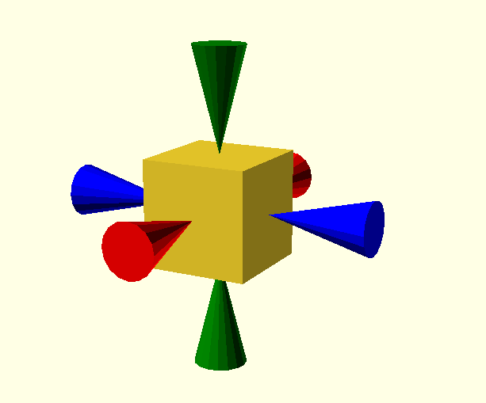

### Simple manual measuring tool for openscad

The tool takes 2 parameters, the distance to measure
and the xyz position to start the measurement.

There are actually three tools, one for each axis.

```openscad

//example.scad

use <measurement.scad>

pos = [20,100,20];
translate(pos){
   cube([20,20,20]);
   
   color("blue")
     x_measurement(20,[0,10,10]);
     
   color("red")
     y_measurement(20,[10,0,10]);
     
   color("green")
     z_measurement(20,[10,10,0]);
}
```
results in the image


You can also use the widget with the openscad customiser as shown below


```openscad
use <measurement.scad>

xangle = -35;
yangle = 45;
distance = 34;

cube([20,20,20]);

rotate([0,yangle,0])
  rotate([xangle,0,0])
    color("green")
      z_measurement(distance,[0,0,0]);
```

